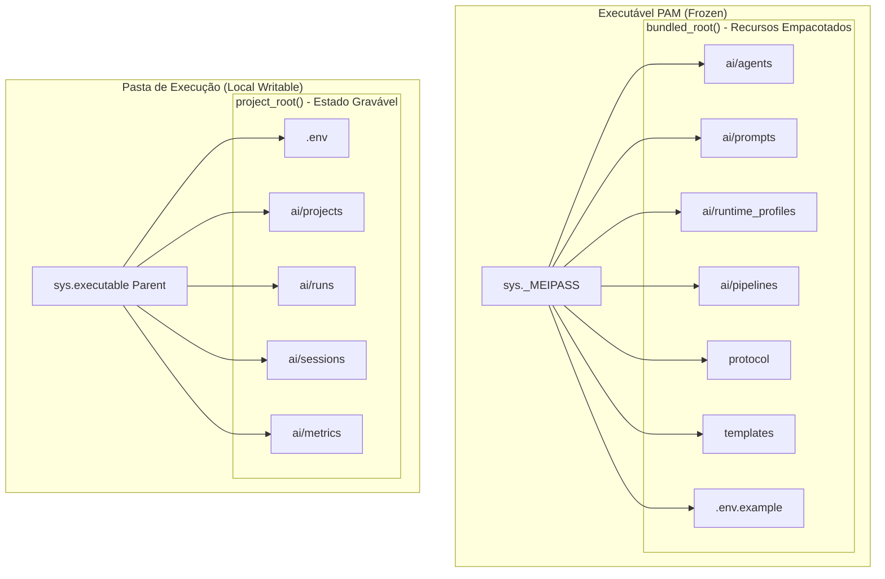

# Distribuição Portátil (Portable Build Foundation)

Este guia orienta sobre como empacotar e utilizar o **Project Agent Manager (PAM)** como um executável portátil `.exe` autônomo (ou executável nativo em Linux/macOS), facilitando demonstrações a clientes, compartilhamento simplificado e uso imediato sem necessidade de configurar um ambiente Python completo.

---

## 1. Arquitetura Dual-Path (Caminho Duplo)

Para permitir a portabilidade total sem requerer caminhos fixos ou depender de arquivos no diretório temporário do PyInstaller (que é excluído após a execução), o PAM foi estruturado com uma arquitetura **Dual-Path**:



### Caminho 1: `bundled_root()` (Recursos Integrados)
- **O que é:** Um diretório de leitura que armazena os recursos estáticos que vêm embutidos na aplicação.
- **Resolução:** Quando congelado (`sys.frozen`), resolve para o diretório temporário do PyInstaller (`sys._MEIPASS`). Quando em desenvolvimento, resolve para a raiz do repositório.
- **Recursos lidos por esta rota:**
  - Definições de agentes (`ai/agents/`)
  - Templates de prompts base (`ai/prompts/`)
  - Perfis de execução padrão (`ai/runtime_profiles/default_profiles.yaml`)
  - Definições de pipeline (`ai/pipelines/`)
  - Protocolo oficial de IA (`protocol/`)
  - Modelos de onboarding (`pam/templates/`)
  - Arquivo de variáveis padrão (`.env.example`)

### Caminho 2: `project_root()` (Estado Writable do Usuário)
- **O que é:** O diretório de trabalho local onde o usuário salva suas configurações individuais, chaves de API e históricos de execução.
- **Resolução:** Quando congelado (`sys.frozen`), resolve para a pasta onde o executável `pam.exe` está localizado. Quando em desenvolvimento, resolve para a raiz do repositório.
- **Recursos gerados e mantidos nesta rota:**
  - Arquivo de configuração de credenciais e chaves de API (`.env`)
  - Definições de projetos cadastrados (`ai/projects/`)
  - Histórico de execuções de agentes e logs (`ai/runs/`)
  - Histórico e sessões de orquestração multi-agente (`ai/sessions/`)
  - Logs mensais de métricas e observabilidade (`ai/metrics/`)

---

## 2. Compilando o Executável

O repositório fornece um script automatizado de empacotamento em `scripts/build_executable.py`.

### Pré-requisitos
Você precisará do PyInstaller instalado no mesmo ambiente virtual do projeto:
```powershell
pip install pyinstaller
```

### Executando o Build
Para compilar a aplicação no Windows:
```powershell
python scripts/build_executable.py
```

O script realizará:
1. Limpeza de builds anteriores.
2. Identificação automática da plataforma para ajuste de separadores de caminho de dados.
3. Mapeamento de todas as pastas estáticas e templates com a flag `--add-data`.
4. Compilação no modo `--onefile` (gerando um único arquivo portátil).

Após a conclusão, o executável estará disponível em:
```text
dist/pam.exe
```

---

## 3. Guia de Uso Portátil

Uma vez compilado o `pam.exe`, a distribuição e uso são extremamente simples:

1. **Cópia do Arquivo:** Copie apenas o arquivo `pam.exe` (cerca de 10-15MB) para qualquer diretório do seu sistema ou de um cliente (exemplo: `C:\PAM\`).
2. **Primeira Execução:**
   - Execute no terminal: `.\pam.exe --list-projects`
   - O PAM criará automaticamente um arquivo `.env` vazio ao lado do executável baseado no template interno.
3. **Configuração de Chaves:**
   - Configure o provider localmente sem expor a chave de terceiros:
     ```powershell
     .\pam.exe set-key gemini
     ```
   - Digite sua chave de API com segurança (entrada protegida). O valor será salvo unicamente no `.env` da mesma pasta.
4. **Onboarding de Projetos:**
   - Você pode rodar a GUI diretamente:
     ```powershell
     .\pam.exe gui
     ```
   - Ou usar a CLI portátil para fazer o onboarding de um repositório existente:
     ```powershell
     .\pam.exe onboard "C:\caminho\para\meu-projeto"
     ```
   - O onboarding criará a pasta local `ai/` dentro de `meu-projeto` com todos os agentes e protocolos copiados do bundle do PAM, e registrará a referência em `ai/projects/` ao lado do seu executável portátil.

---

## 4. Segurança e Boas Práticas

- **Sem Chaves Embutidas:** O script de build nunca inclui o `.env` local do desenvolvedor no executável. O executável é distribuído "limpo".
- **Sem Modificações Globais:** O executável não altera o Registro do Windows e não cria arquivos na pasta do usuário `AppData` ou `Temp` persistentes, permitindo remover todo o estado do PAM apenas deletando a pasta onde ele reside.
- **Portabilidade de Demonstrações:** Você pode colocar o `pam.exe` com um arquivo `.env` pré-configurado com chaves de demonstração temporárias em um pendrive e rodar em qualquer máquina de cliente instantaneamente.
